# 🧠 Eva: Multi-Agent Cognitive Engine

> The hierarchical AI backend powering intelligent reflections, mood analysis, and proactive personalization for the Midnight Momentum application.

## 📖 Overview

**Eva** is a standalone, state-of-the-art **Hierarchical Multi-Agent System** built with [LangGraph](https://python.langchain.com/docs/langgraph) and hosted on **Google Cloud Vertex AI**. 

While traditional chatbots simply reply to prompts, Eva is designed as an integrated cognitive co-pilot. She acts as the "brain" for the client application (Midnight Momentum), actively analyzing incoming user states, extracting life aspirations, dynamically managing database records, and autonomously triggering external application events.

*Note: This repository outlines Eva's architectural design, multi-agent structure, and tool integration. The client application (Midnight Momentum) is maintained in a separate repository.*

---

## ⚡ Tech Stack

Eva’s architecture leverages a modern, high-performance stack optimized for scalable, complex AI agent workflows:

- **Environment & Orchestration:** Google Cloud Vertex AI & LangGraph (Python)
- **Large Language Models (LLMs):** 
  - **Gemini 2.5 Pro:** Powers the Leader agent for complex reasoning, state evaluation, and intelligent task routing.
  - **Gemini 2.5 Flash & Gemini 3 Flash:** Powers specialized sub-agents for lightning-fast, cost-effective tool execution, summarization, and data extraction.
- **State Management:** Redis (High-speed state connection and LangGraph checkpointer for conversation memory)
- **Persistent Memory:** PostgreSQL (Relational storage for Moments, Moods, and Future Self Personas)

---

## 🏗️ System Architecture

Eva is designed using a **Supervisor/Worker Hierarchy**. The Leader acts as the central router, taking in the user's context from the client app and delegating tasks to highly specialized sub-agents. 

<!-- Insert Mermaid Diagram Here -->

---

## 🧠 Core Cognitive Components

To maximize efficiency, lower latency, and maintain clean context windows, Eva avoids relying on a single "mega-prompt." Instead, cognitive load is distributed across specialized agents.

### 1. The Leader (Supervisor Agent)
*Powered by Gemini 2.5 Pro.* 
The orchestrator of the LangGraph state. Whenever a payload is received from the client app (e.g., a chat message or a mood log), the Leader evaluates the intent, parses the Redis graph state, and routes the task to the exact sub-agent required. It then merges the outputs to return a cohesive response to the client.

### 2. 💭 Reflection Agent
*Goal: Prevent surface-level journaling by prompting deep thought.*
* **Mechanism:** Uses internal tools to analyze incoming text. Instead of a standard conversational reply, it identifies missing context and actively prompts the client application to ask the user clarifying questions, helping them unpack their true feelings and motivations.

### 3. 🔮 Insight & Mood Agent
*Goal: Track emotional trajectories and map out ultimate goals.*
* **Mechanism:** Continuously monitors mood arrays and summarizes recent moments. It utilizes specialized data-extraction tools to pull out long-term aspirations, dynamically generating and updating a **"Future Self Persona"** in PostgreSQL. This persona acts as the foundational context for all of Eva's future logic.

### 4. 📝 Moment Agent
*Goal: Autonomously manage the user's data structure.*
* **Mechanism:** Equipped with database CRUD capabilities. If the user mentions a new plan, thought, or burst of motivation in natural language, this agent automatically maps it to the schema and generates a structured "Moment" in PostgreSQL. It can also autonomously fetch and edit existing records based on new conversational context.

### 5. 🔔 Notification Agent
*Goal: Deliver highly personalized, context-aware nudges.*
* **Mechanism:** Bridges the gap between Eva's backend and the client's frontend. It leverages the user's Future Self Persona and recent Moments to draft highly bespoke notification copy. It then calls the `ScheduleNudgeTool` to interface directly with the client app's native notification engine.

---

## 🔄 Bidirectional API Paradigm

Most AI API integrations are unidirectional (Client asks → AI answers). Eva is designed as a **bidirectional engine**:

1. **Client ➡️ Eva**: The client app feeds UI interactions, explicit mood tracking, and chat history into Eva's LangGraph state (managed securely in Redis).
2. **Eva ➡️ Client**: Eva acts *on* the client. Through secure tool calling via Vertex AI, she autonomously manages PostgreSQL database entries (Moments) and actively triggers features on the client's operating system (Push Notifications). 

---

```mermaid
flowchart TB
    %% ==========================================
    %% 🎨 STYLING DEFINITIONS
    %% ==========================================
    classDef externalClient fill:#111827,stroke:#374151,stroke-width:2px,color:#9CA3AF,stroke-dasharray: 5 5
    classDef evaLeader fill:#3B0764,stroke:#9333EA,stroke-width:3px,color:#F3E8FF
    classDef subAgent fill:#1E1B4B,stroke:#6366F1,stroke-width:2px,color:#E0E7FF
    classDef tool fill:#064E3B,stroke:#10B981,stroke-width:1px,color:#D1FAE5
    classDef database fill:#0F172A,stroke:#3B82F6,stroke-width:2px,color:#DBEAFE
    classDef env fill:#171717,stroke:#525252,stroke-width:1px,color:#A3A3A3

    %% ==========================================
    %% 📱 CLIENT LAYER (Midnight Momentum)
    %% ==========================================
    subgraph Client["📱 External Client (Midnight Momentum App)"]
        AppChat["Chat UI"]:::externalClient
        AppMood["Mood Logger"]:::externalClient
        AppPush["Native Push Engine"]:::externalClient
    end

    %% ==========================================
    %% ☁️ VERTEX AI / LANGGRAPH LAYER (Eva)
    %% ==========================================
    subgraph VertexAI ["☁️ Hosted Environment (GCP Vertex AI)"]
        
        Leader["👑 Eva Leader Agent (Supervisor)\n[Model: Gemini 2.5 Pro]\nEvaluates Intent, Routes Tasks, Merges Outputs"]:::evaLeader

        %% --- 🤖 SUB-AGENTS ---
        subgraph SubAgents ["🤖 Specialized Sub-Agents (Models: Gemini 2.5 / 3 Flash)"]
            AgentReflect["💭 Reflection Agent\n(Unpacks thoughts)"]:::subAgent
            AgentInsight["🔮 Insight & Mood Agent\n(Analyzes emotional trajectory)"]:::subAgent
            AgentMoment["📝 Moment Agent\n(Manages plans/thoughts)"]:::subAgent
            AgentNotify["🔔 Notification Agent\n(Proactive nudges)"]:::subAgent
        end

        %% --- 🛠️ TOOLS (Mapped per Sub-Agent) ---
        subgraph Tools ["🛠️ Specialized Agent Tools (Function Calling)"]
            Tool_AskContext["AskContextTool()\nRequests clarifying details"]:::tool
            Tool_ExtendThought["ExtendThoughtTool()\nDeepens user's surface statement"]:::tool
            
            Tool_SummarizeMood["SummarizeMoodTool()\nAnalyzes recent mood arrays"]:::tool
            Tool_ExtractAspirations["ExtractAspirationsTool()\nPulls goals from conversation"]:::tool
            Tool_UpdatePersona["UpdatePersonaTool()\nRefines 'Future Self Persona'"]:::tool
            
            Tool_CreateMoment["CreateMomentTool()\nAuto-generates a new moment"]:::tool
            Tool_EditMoment["EditMomentTool()\nModifies existing moment"]:::tool
            Tool_SearchMoments["SearchMomentsTool()\nFetches semantic context"]:::tool
            
            Tool_DraftNudge["DraftNudgeTool()\nWrites copy using Persona"]:::tool
            Tool_SchedulePush["SchedulePushTool()\nFires scheduling API"]:::tool
        end
    end

    %% ==========================================
    %% 🗄️ STORAGE & STATE LAYER
    %% ==========================================
    subgraph Storage ["🗄️ Memory & State Infrastructure"]
        DB_Redis[(Redis\nHigh-Speed LangGraph State & Checkpoints)]:::database
        DB_Postgres[(PostgreSQL\nRelational DB: Moments, Moods, Persona)]:::database
    end

    %% ==========================================
    %% 🔄 RELATIONSHIPS & DATA FLOW
    %% ==========================================

    %% 1. Client to Leader
    AppChat <-->|Chat Payload| Leader
    AppMood -->|Mood Log Payload| Leader

    %% 2. State Management (Explicitly mapping nodes to DB to prevent subgraph errors)
    Leader <-->|Reads/Writes Checkpoints| DB_Redis
    AgentReflect -.->|Updates Graph State| DB_Redis
    AgentInsight -.->|Updates Graph State| DB_Redis
    AgentMoment -.->|Updates Graph State| DB_Redis
    AgentNotify -.->|Updates Graph State| DB_Redis

    %% 3. Leader to Sub-Agents (Routing)
    Leader -->|Delegates Context| AgentReflect
    Leader -->|Delegates Context| AgentInsight
    Leader -->|Delegates Context| AgentMoment
    Leader -->|Delegates Context| AgentNotify

    %% 4. Sub-Agents to Tools (Execution mapped 1-to-1 for safety)
    AgentReflect --> Tool_AskContext
    AgentReflect --> Tool_ExtendThought
    
    AgentInsight --> Tool_SummarizeMood
    AgentInsight --> Tool_ExtractAspirations
    AgentInsight --> Tool_UpdatePersona
    
    AgentMoment --> Tool_CreateMoment
    AgentMoment --> Tool_EditMoment
    AgentMoment --> Tool_SearchMoments
    
    AgentNotify --> Tool_DraftNudge
    AgentNotify --> Tool_SchedulePush

    %% 5. Tools to External / DB Actions
    Tool_AskContext -.->|Requires UI Follow-up| AppChat
    
    Tool_SummarizeMood -.->|Reads Moods| DB_Postgres
    Tool_ExtractAspirations -.->|Reads Chat History| DB_Postgres
    Tool_UpdatePersona -.->|Upserts Persona| DB_Postgres
    
    Tool_CreateMoment -.->|Inserts Row| DB_Postgres
    Tool_EditMoment -.->|Updates Row| DB_Postgres
    Tool_SearchMoments -.->|Queries DB| DB_Postgres
    
    Tool_DraftNudge -.->|Reads Persona| DB_Postgres
    Tool_SchedulePush -.->|Triggers App API| AppPush

    %% Apply class styling securely at the very end
    class VertexAI env
```

*Disclaimer: This repository serves as a structural and architectural showcase. Proprietary agent prompts, internal schema logic, and specific LangGraph implementation scripts are kept private to protect core intellectual property.*
